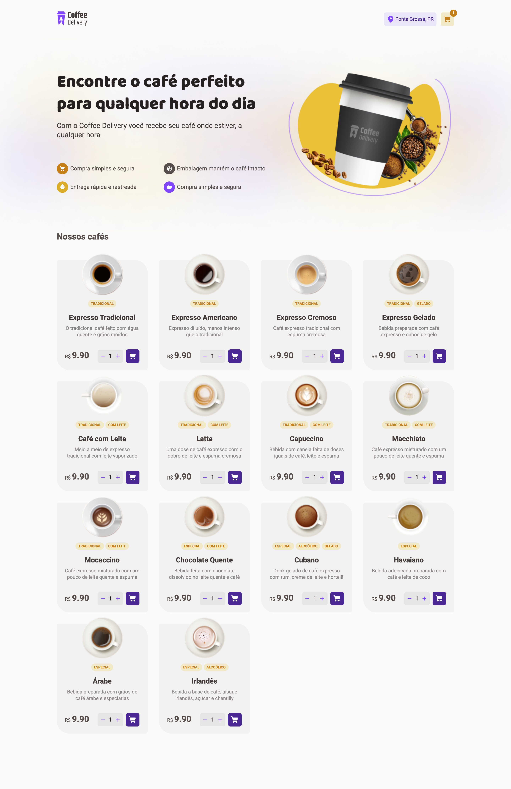
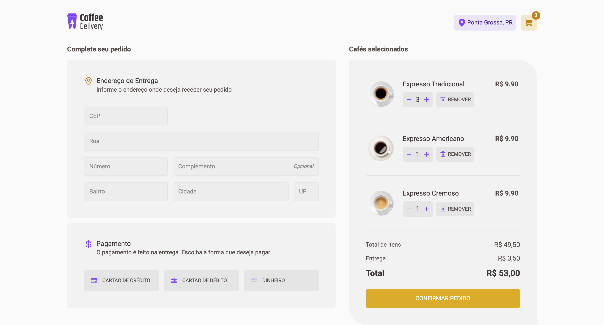
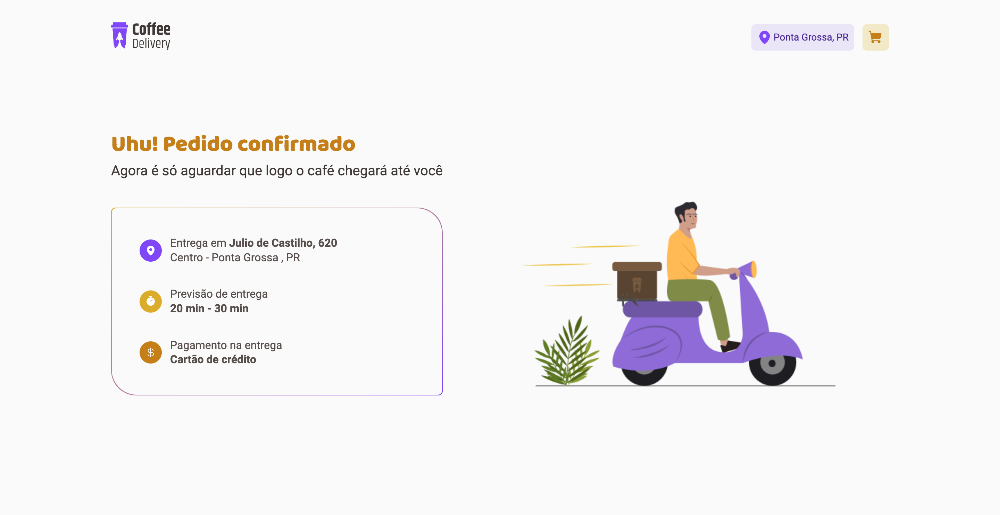

# Ignite Coffee

### Projeto desenvolvido no desafio 02 no curso de ReactJS do Ignite da Rocketseat

## Tecnologias

Esse projeto foi desenvolvido com as seguintes tecnologias:

- [React](https://react.dev/)
- [Styled-Components](https://styled-components.com/)
- [React Router Dom](https://reactrouter.com/en/main)
- [React Hook Form](https://react-hook-form.com/)
- [Zod](https://zod.dev/)

## Previews

- Home
  

- Cart
  

- Success
  

## Layout

É possível visualizar o layout do projeto através [desse link](<https://www.figma.com/file/HGjJIu814pXklrM67hKI6H/Coffee-Delivery-%E2%80%A2-Desafio-React-(Copy)?type=design&node-id=0-1&mode=design&t=ZRWVmz9RF8pK1NKt-0>). É necessário possuir uma conta no Figma.

## Instalação

1. git clone https://github.com/RickyHideyukiTakakura/ignite-coffee
2. cd ignite-coffee
3. npm install ou yarn install

## Projeto

Este é um site que simula um delivery, podendo adicionar cafés ao carrinho e confirmar o pedido informando o endereço e forma de pagamento.

### O objetivo da criação do projeto é exercitar conceitos do React como:

- Routes
- Forms
- Context
- Reducer
